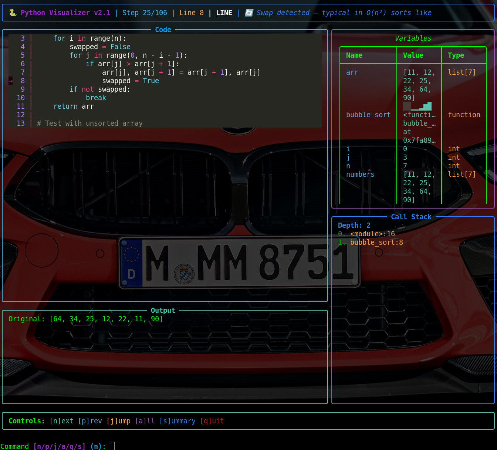

# Conjure: Python Code Visualizer v2.1 - DSA Mastery Edition

[](https://www.python.org/downloads/)
[](https://opensource.org/licenses/MIT)
[](https://github.com/sushink70/conjure/blob/main/CONTRIBUTING.md)




**Conjure** is a production-ready CLI tool for visualizing Python code execution step-by-step. Designed for Data Structures and Algorithms (DSA) mastery, it provides interactive traces, visual hints for common patterns (e.g., recursion, DP tables, graph traversals), and complexity analysis. Perfect for debugging, learning, or teaching—watch your code come alive!

Key highlights:
- **Step-by-step execution** with call stack, variables, and output.
- **DSA-focused hints**: Detects swaps, visited sets, recursion depth, and more.
- **Security-first**: Redacts sensitive data, caps recursion/loops to prevent hangs.
- **Rich TUI**: Beautiful, interactive interface powered by [Rich](https://rich.readthedocs.io/).

> **Why Conjure?** Because debugging DSA code shouldn't feel like black magic. Conjure reveals the "why" behind your Big O with visuals and insights.

## Features

- **Interactive & Auto Modes**: Step through code manually or auto-play with delays.
- **Execution Tracing**: Captures locals/globals, call stack, and events (line/call/return).
- **DSA Hints**: Real-time tips like "🔄 Swap detected – O(n²) sort" or "📊 DP table update".
- **Complexity Detection**: AST-based analysis for O(n), O(n²), recursion, graphs, etc.
- **Visual Bars for Lists**: Numeric arrays render as mini bar charts for quick insights.
- **Error Handling**: Graceful detection of infinite loops, deep recursion, and syntax issues with fix suggestions.
- **Export & Filter**: JSON traces, event filtering (e.g., only 'line' events).
- **Security Caps**: Hard limit of 10,000 steps; redacts passwords/tokens.
- **Summary Mode**: Quick metrics on coverage, hotspots, and detected patterns.
- **Built-in Examples**: Starts with Bubble Sort if no file provided.

## Installation

1. **Prerequisites**: Python 3.8+.

2. **Install Dependencies**:
   ```bash
   pip install rich
   ```

3. **Clone the Repo**:
   ```bash
   git clone https://github.com/sushink70/conjure.git
   cd conjure
   ```

4. **Run Directly** (no install needed):
   ```bash
   python conjure.py your_script.py
   ```

> **Pro Tip**: Add to your PATH for global use: `ln -s $(pwd)/conjure.py /usr/local/bin/conjure`.

## Usage

```bash
python conjure.py [options] <file.py>
```

### Command Line Options

| Flag | Description | Example |
|------|-------------|---------|
| `-h, --help` | Show help | `python conjure.py --help` |
| `--stdin` | Read code from stdin | `echo "print('Hi')" \| python conjure.py --stdin` |
| `--auto` | Auto-play mode | `python conjure.py script.py --auto --delay 0.2` |
| `--delay FLOAT` | Delay (s) in auto mode (default: 0.5) | `--delay 1.0` |
| `--summary-only` | Show metrics/complexity only | `python conjure.py --summary-only` |
| `--filter-events EVENTS` | Filter events (e.g., 'line,call') | `--filter-events line` |
| `--export FILE` | Export trace to JSON | `--export trace.json` |
| `--max-steps INT` | Max trace steps (default: 500, max: 10k) | `--max-steps 1000` |

If no file is provided, it runs a built-in Bubble Sort example.

### Interactive Controls

In interactive mode:
- `n`: Next step
- `p`: Previous step
- `j`: Jump to step (prompts for number)
- `a`: Toggle full file/context view
- `s`: Show summary
- `q`: Quit

## Examples

### 1. Basic Interactive Run
```bash
python conjure.py examples/bubble_sort.py
```
- Traces the sort, highlights swaps with hints, shows variable bars.

### 2. Auto-Play with Export
```bash
python conjure.py examples/fibonacci.py --auto --delay 0.3 --export fib_trace.json
```
- Plays recursion visualization; exports steps for analysis.

### 3. Summary-Only for Complexity Check
```bash
python conjure.py examples/graph_dfs.py --summary-only
```
Output:
```
📊 Execution Summary
┌─────────────────────────┬──────────┐
│ Metric                  │ Value    │
├─────────────────────────┼──────────┤
│ Total Steps             │ 245      │
│ Unique Lines Executed   │ 18 (95.0% coverage) │
│ Function Calls          │ 12       │
│ Max Stack Depth         │ 5        │
│ Unique Variables        │ 7        │
│ Detected Complexity     │ O(V+E) - Graph traversal (DFS/BFS); Recursion with memoization - O(n) to O(n²) time │
└─────────────────────────┴──────────┘

🔥 Hotspots (Most Executed Lines)
┌────────┬──────────────┬──────────────────────────────────────────────┐
│ Line   │ Executions   │ Code                                         │
├────────┼──────────────┼──────────────────────────────────────────────┤
│ 12     │ 34           │ if node not in visited:                      │
│ 15     │ 28           │ visited.add(node)                            │
│ 18     │ 25           │ for neighbor in graph[node]:                 │
└────────┴──────────────┴──────────────────────────────────────────────┘

Hints detected: 🔗 Graph structure – O(V+E) traversal expected, 🔍 Visited tracking – DFS/BFS traversal in progress
```

### 4. Stdin Mode for Quick Tests
```bash
echo "
def factorial(n):
    if n <= 1:
        return 1
    return n * factorial(n-1)

print(factorial(5))
" | python conjure.py --stdin --auto
```
- Visualizes recursion with depth warnings if unchecked.

## Built-in Examples

Check the `examples/` folder:
- `bubble_sort.py`: O(n²) quadratic sort with swap visuals.
- `fibonacci.py`: Recursive vs. memoized versions.
- `graph_dfs.py`: Graph traversal with visited hints.
- `dp_knapsack.py`: Table updates and space complexity.

## Error Handling & Tips

- **Infinite Loops**: Stops at max steps with suggestions (e.g., "Add break condition").
- **Deep Recursion**: Detects >100 frames; suggests base cases.
- **Syntax Errors**: Highlights line with Python's message.
- **Sensitive Data**: Auto-redacts `password`, `token`, etc., in variable display.

If execution hangs, increase `--max-steps` or check for loops/recursion.

## Contributing

This project is 100% open source—fork, improve, and share freely! We welcome all contributions, from bug fixes to new DSA detectors (e.g., tree traversals).

### How to Contribute
1. Fork the repo & clone locally.
2. Create a feature branch (`git checkout -b feat/amazing-new-hint`).
3. Make your changes & add tests (use `pytest` if adding).
4. Commit (`git commit -m "Add tree balance hint"`).
5. Push & open a PR!

**Guidelines**:
- Follow PEP 8 style.
- Update version in docstring for releases.
- Add examples for new features.
- See [CONTRIBUTING.md](CONTRIBUTING.md) for details.

**Roadmap Ideas**:
- Web UI export (HTML traces).
- More DSA patterns (e.g., union-find, sliding windows).
- Integration with Jupyter/IPython.
- Performance benchmarks.

Shoutout to early contributors—let's make DSA visualization magical! 🌟

## License

MIT License—free to use, modify, and distribute. See [LICENSE](LICENSE) for details.

---

**Built with ❤️ by the Conjure Community** | [Issues](https://github.com/sushink70/conjure/issues) | [Stars Welcome!](https://github.com/sushink70/conjure)